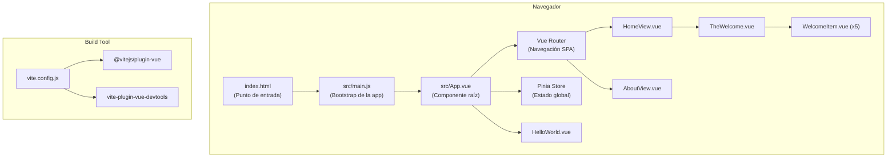
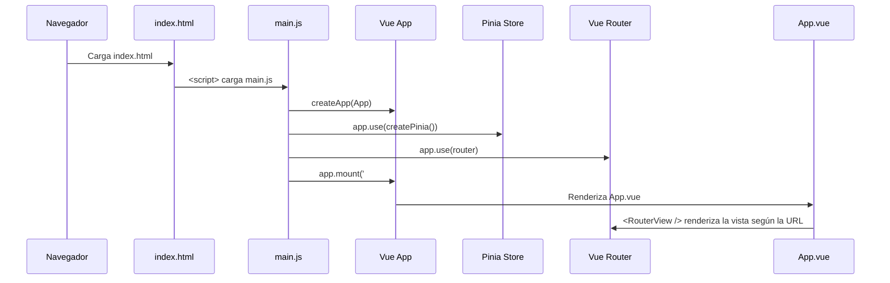
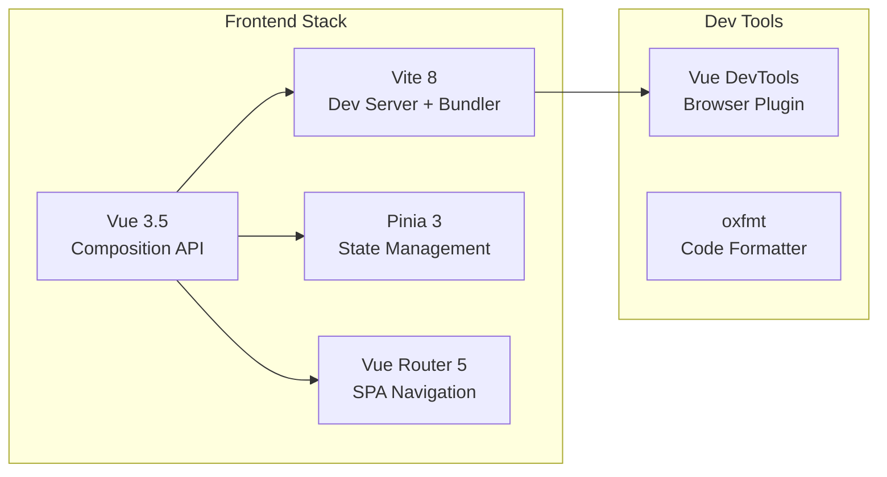

# 📋 Documentación del Proyecto `to-do-front`

> Frontend de la aplicación To-Do, construido con **Vue 3 + Vite + Pinia + Vue Router**.
> Es la parte visual (cliente) del monorepo `To-do_nest-vue`, cuyo backend está en `to-do-back` (NestJS).

---

## 📌 Información General

| Campo | Valor |
|---|---|
| **Nombre** | `to-do-front` |
| **Versión** | `0.0.0` |
| **Tipo de módulo** | ESM (`"type": "module"`) |
| **Framework** | Vue 3 (Composition API con `<script setup>`) |
| **Bundler** | Vite 8 |
| **State Management** | Pinia 3 |
| **Routing** | Vue Router 5 |
| **Node requerido** | `^20.19.0 \|\| >=22.12.0` |

---

## 🏗️ Arquitectura del Proyecto

El proyecto sigue la arquitectura estándar de una aplicación Vue 3 generada con `create-vue`:



---

## 📂 Estructura de Archivos

```
to-do-front/
├── index.html                  # Punto de entrada HTML (SPA)
├── package.json                # Dependencias y scripts
├── vite.config.js              # Configuración de Vite
├── jsconfig.json               # Alias de paths para el IDE
├── .gitignore                  # Archivos ignorados por Git
├── .oxfmtrc.json               # Configuración del formateador oxfmt
├── README.md                   # README generado por create-vue
├── public/                     # Assets estáticos (servidos tal cual)
│   └── favicon.ico
├── node_modules/               # Dependencias instaladas
└── src/                        # Código fuente principal
    ├── main.js                 # Bootstrap: crea la app Vue, registra plugins
    ├── App.vue                 # Componente raíz (layout principal)
    ├── assets/                 # Assets procesados por Vite
    │   ├── base.css            # Variables CSS y reset global
    │   ├── main.css            # Estilos principales de la app
    │   └── logo.svg            # Logo de Vue
    ├── components/             # Componentes reutilizables
    │   ├── HelloWorld.vue      # Componente de saludo con prop `msg`
    │   ├── TheWelcome.vue      # Panel de bienvenida con links útiles
    │   ├── WelcomeItem.vue     # Item individual del panel (usa slots)
    │   └── icons/              # Componentes SVG de iconos
    │       ├── IconCommunity.vue
    │       ├── IconDocumentation.vue
    │       ├── IconEcosystem.vue
    │       ├── IconSupport.vue
    │       └── IconTooling.vue
    ├── router/                 # Configuración de rutas
    │   └── index.js            # Define las rutas de la SPA
    ├── stores/                 # Stores de Pinia (estado global)
    │   └── counter.js          # Store de ejemplo (contador)
    └── views/                  # Vistas/páginas (una por ruta)
        ├── HomeView.vue        # Página principal (ruta "/")
        └── AboutView.vue       # Página About (ruta "/about")
```

---

## 🔧 Archivos de Configuración

### [index.html](file:///c:/Users/ViSucreNet/Desktop/personal/To-do_nest-vue/to-do-front/index.html)

Punto de entrada de la SPA. Contiene:
- El `<div id="app">` donde Vue monta toda la aplicación.
- La etiqueta `<script type="module">` que carga `src/main.js`.
- Vite inyecta automáticamente los assets compilados aquí durante el build.

### [vite.config.js](file:///c:/Users/ViSucreNet/Desktop/personal/To-do_nest-vue/to-do-front/vite.config.js)

Configuración del bundler Vite:

```js
export default defineConfig({
  plugins: [
    vue(),              // Soporte para archivos .vue (SFC)
    vueDevTools(),      // Panel de DevTools integrado en desarrollo
  ],
  resolve: {
    alias: {
      '@': fileURLToPath(new URL('./src', import.meta.url))
      // Permite importar con '@/...' en vez de rutas relativas
    },
  },
})
```

| Plugin | Propósito |
|---|---|
| `@vitejs/plugin-vue` | Compila archivos `.vue` (Single File Components) |
| `vite-plugin-vue-devtools` | Agrega un panel de DevTools en el navegador durante desarrollo |

### [jsconfig.json](file:///c:/Users/ViSucreNet/Desktop/personal/To-do_nest-vue/to-do-front/jsconfig.json)

Configura el alias `@/*` → `./src/*` para que el IDE (VSCode) resuelva las importaciones correctamente. Excluye `node_modules` y `dist` del análisis.

### [package.json](file:///c:/Users/ViSucreNet/Desktop/personal/To-do_nest-vue/to-do-front/package.json)

Define las dependencias y scripts del proyecto.

---

## 📦 Dependencias

### Producción

| Paquete | Versión | Descripción |
|---|---|---|
| `vue` | `^3.5.32` | Framework reactivo para construir interfaces de usuario |
| `pinia` | `^3.0.4` | Store oficial de Vue para manejo de estado global |
| `vue-router` | `^5.0.4` | Router oficial de Vue para navegación SPA |

### Desarrollo

| Paquete | Versión | Descripción |
|---|---|---|
| `vite` | `^8.0.8` | Bundler ultrarrápido basado en ES modules |
| `@vitejs/plugin-vue` | `^6.0.6` | Plugin de Vite para compilar archivos `.vue` |
| `vite-plugin-vue-devtools` | `^8.1.1` | DevTools integradas en el navegador |
| `oxfmt` | `^0.45.0` | Formateador de código (alternativa a Prettier) |

---

## 🚀 Comandos Disponibles

```bash
# Instalar dependencias
npm install

# Iniciar servidor de desarrollo (con HMR - Hot Module Replacement)
npm run dev

# Compilar para producción (genera archivos en /dist)
npm run build

# Previsualizar el build de producción localmente
npm run preview

# Formatear código fuente con oxfmt
npm run format
```

---

## 🔄 Flujo de Arranque de la Aplicación



### Detalle paso a paso:

1. **El navegador carga `index.html`** — encuentra el `<div id="app">` y el script `main.js`.
2. **`main.js` se ejecuta:**
   - Importa los estilos globales (`main.css` → que importa `base.css`).
   - Crea la instancia de Vue con `createApp(App)`.
   - Registra **Pinia** como plugin (estado global).
   - Registra **Vue Router** como plugin (navegación).
   - Monta la app en el DOM (`#app`).
3. **`App.vue` se renderiza** — muestra el header con logo, navegación y `<RouterView>`.
4. **Vue Router** determina qué vista mostrar según la URL actual.

---

## 📄 Archivos Fuente — Detalle Completo

### [src/main.js](file:///c:/Users/ViSucreNet/Desktop/personal/To-do_nest-vue/to-do-front/src/main.js) — Punto de entrada JS

```js
import './assets/main.css'          // 1. Carga estilos globales
import { createApp } from 'vue'     // 2. Función para crear la app
import { createPinia } from 'pinia' // 3. Creador del store
import App from './App.vue'          // 4. Componente raíz
import router from './router'        // 5. Configuración de rutas

const app = createApp(App)           // Crea instancia Vue
app.use(createPinia())               // Registra Pinia (estado global)
app.use(router)                      // Registra Vue Router (navegación)
app.mount('#app')                    // Monta en el DOM
```

> [!NOTE]
> El orden de `app.use()` importa: Pinia se registra antes que el Router porque algunos guards de navegación podrían necesitar acceder al store.

---

### [src/App.vue](file:///c:/Users/ViSucreNet/Desktop/personal/To-do_nest-vue/to-do-front/src/App.vue) — Componente Raíz

Es el **layout principal** de toda la aplicación. Contiene:

| Sección | Contenido |
|---|---|
| `<script setup>` | Importa `RouterLink`, `RouterView` y `HelloWorld` |
| `<template>` | Header con logo + `HelloWorld` + navegación + `<RouterView>` |
| `<style scoped>` | Estilos del layout (responsive con media query a 1024px) |

**Estructura visual:**

```
┌─────────────────────────────────────────┐
│  HEADER                                 │
│  ┌──────┐  ┌──────────────────────────┐ │
│  │ Logo │  │ HelloWorld ("You did it!")│ │
│  │ .svg │  │                          │ │
│  └──────┘  │ [Home] | [About]         │ │
│            └──────────────────────────┘ │
├─────────────────────────────────────────┤
│  <RouterView />                         │
│  (Aquí se renderiza la vista activa)    │
└─────────────────────────────────────────┘
```

**Comportamiento responsive:**
- **Móvil (<1024px):** Logo centrado arriba, navegación centrada debajo.
- **Desktop (≥1024px):** Layout flex horizontal — logo a la izquierda, contenido a la derecha.

---

### [src/router/index.js](file:///c:/Users/ViSucreNet/Desktop/personal/To-do_nest-vue/to-do-front/src/router/index.js) — Configuración de Rutas

```js
const router = createRouter({
  history: createWebHistory(import.meta.env.BASE_URL),
  routes: [
    { path: '/',      name: 'home',  component: HomeView },
    { path: '/about', name: 'about', component: () => import('../views/AboutView.vue') },
  ],
})
```

| Ruta | Nombre | Componente | Carga |
|---|---|---|---|
| `/` | `home` | `HomeView.vue` | **Eager** (se carga inmediatamente) |
| `/about` | `about` | `AboutView.vue` | **Lazy** (se carga bajo demanda, genera chunk separado) |

> [!TIP]
> La ruta `/about` usa **lazy loading** con `() => import(...)`. Esto genera un archivo JS separado (`About.[hash].js`) que solo se descarga cuando el usuario navega a esa ruta. Mejora el tiempo de carga inicial.

**Modo de historia:** `createWebHistory` — usa la History API del navegador (URLs limpias sin `#`). Requiere configuración del servidor para redirigir todas las rutas a `index.html` en producción.

---

### [src/stores/counter.js](file:///c:/Users/ViSucreNet/Desktop/personal/To-do_nest-vue/to-do-front/src/stores/counter.js) — Store de Pinia

```js
export const useCounterStore = defineStore('counter', () => {
  const count = ref(0)                              // Estado reactivo
  const doubleCount = computed(() => count.value * 2) // Getter computado
  function increment() { count.value++ }             // Acción/mutación

  return { count, doubleCount, increment }
})
```

> [!NOTE]
> Este es un **store de ejemplo** generado por `create-vue`. Usa la sintaxis de **Composition API** (Setup Store) de Pinia. Actualmente **no se usa** en ningún componente, pero está listo como base para el estado global de la aplicación To-Do.

| Propiedad | Tipo | Descripción |
|---|---|---|
| `count` | `ref(0)` | Valor del contador (estado) |
| `doubleCount` | `computed` | Valor del contador × 2 (getter derivado) |
| `increment()` | `function` | Incrementa `count` en 1 (acción) |

**Uso futuro:** Este store se debería reemplazar/complementar con un store de tareas (`useTodoStore`) que maneje el estado del CRUD de To-Do conectado al backend NestJS.

---

### Vistas (Views)

#### [HomeView.vue](file:///c:/Users/ViSucreNet/Desktop/personal/To-do_nest-vue/to-do-front/src/views/HomeView.vue) — Página Principal

```html
<script setup>
import TheWelcome from '../components/TheWelcome.vue'
</script>
<template>
  <main>
    <TheWelcome />
  </main>
</template>
```

Simplemente renderiza el componente `TheWelcome` dentro de un `<main>`. Es la vista que se muestra en la ruta `/`.

#### [AboutView.vue](file:///c:/Users/ViSucreNet/Desktop/personal/To-do_nest-vue/to-do-front/src/views/AboutView.vue) — Página About

```html
<template>
  <div class="about">
    <h1>This is an about page</h1>
  </div>
</template>
```

Vista minimalista que se carga por lazy loading. En desktop (≥1024px) se centra verticalmente con `display: flex; align-items: center; min-height: 100vh`.

---

### Componentes

#### [HelloWorld.vue](file:///c:/Users/ViSucreNet/Desktop/personal/To-do_nest-vue/to-do-front/src/components/HelloWorld.vue)

| Prop | Tipo | Requerido | Descripción |
|---|---|---|---|
| `msg` | `String` | ✅ | Mensaje a mostrar como título `<h1>` |

Muestra un título `<h1>` con el mensaje recibido y un subtítulo con links a Vite y Vue. Usa la clase `.green` (color verde Vue: `hsla(160, 100%, 37%, 1)`).

#### [TheWelcome.vue](file:///c:/Users/ViSucreNet/Desktop/personal/To-do_nest-vue/to-do-front/src/components/TheWelcome.vue)

Panel de bienvenida que muestra 5 items informativos usando `WelcomeItem`:

| # | Icono | Título | Contenido |
|---|---|---|---|
| 1 | `IconDocumentation` | Documentation | Link a docs oficiales de Vue |
| 2 | `IconTooling` | Tooling | Links a Vite, VSCode, Vitest, Cypress, Playwright |
| 3 | `IconEcosystem` | Ecosystem | Links a Pinia, Vue Router, Vue Test Utils, Vue Dev Tools |
| 4 | `IconCommunity` | Community | Links a Vue Land (Discord), StackOverflow, Bluesky, X |
| 5 | `IconSupport` | Support Vue | Link para ser sponsor de Vue |

También tiene una función `openReadmeInEditor` que hace una petición `fetch` a `/__open-in-editor?file=README.md` para abrir el README en el editor (funcionalidad del dev server de Vite).

#### [WelcomeItem.vue](file:///c:/Users/ViSucreNet/Desktop/personal/To-do_nest-vue/to-do-front/src/components/WelcomeItem.vue)

Componente de layout que usa **named slots**:

| Slot | Propósito |
|---|---|
| `#icon` | Icono SVG a mostrar a la izquierda |
| `#heading` | Título `<h3>` del item |
| *default* | Contenido descriptivo del item |

**Diseño responsive:**
- **Móvil:** Layout flex horizontal simple (icono 32x32 + contenido).
- **Desktop (≥1024px):** Iconos posicionados absolutamente en una línea vertical conectada con bordes (`::before` y `::after`), creando un efecto de "timeline".

#### Componentes de Iconos (`src/components/icons/`)

5 componentes que renderizan SVGs inline como iconos decorativos:

- `IconCommunity.vue` — Icono de comunidad/personas
- `IconDocumentation.vue` — Icono de documentación/libro
- `IconEcosystem.vue` — Icono de ecosistema/engranaje
- `IconSupport.vue` — Icono de soporte/corazón
- `IconTooling.vue` — Icono de herramientas/llave

---

## 🎨 Sistema de Estilos

### [base.css](file:///c:/Users/ViSucreNet/Desktop/personal/To-do_nest-vue/to-do-front/src/assets/base.css)

Define el **design system** del proyecto:

**Variables de color (`:root`):**

| Variable | Claro | Oscuro |
|---|---|---|
| `--color-background` | `#ffffff` | `#181818` |
| `--color-background-soft` | `#f8f8f8` | `#222222` |
| `--color-background-mute` | `#f2f2f2` | `#282828` |
| `--color-border` | `rgba(60,60,60,0.12)` | `rgba(84,84,84,0.48)` |
| `--color-border-hover` | `rgba(60,60,60,0.29)` | `rgba(84,84,84,0.65)` |
| `--color-heading` | `#2c3e50` (indigo) | `#ffffff` |
| `--color-text` | `#2c3e50` (indigo) | `rgba(235,235,235,0.64)` |
| `--section-gap` | `160px` | `160px` |

**Tema oscuro:** Se activa automáticamente con `@media (prefers-color-scheme: dark)` (respeta la preferencia del sistema operativo del usuario).

**Reset global:**
- `box-sizing: border-box` en todos los elementos.
- `margin: 0` y `font-weight: normal` por defecto.
- Body con `min-height: 100vh`, transiciones suaves de color, y tipografía Inter como font principal.

### [main.css](file:///c:/Users/ViSucreNet/Desktop/personal/To-do_nest-vue/to-do-front/src/assets/main.css)

Estilos específicos de la aplicación:

- **`#app`:** Centrado horizontal con `max-width: 1280px`, padding de `2rem`.
- **Links y `.green`:** Color verde Vue (`hsla(160, 100%, 37%, 1)`), hover con fondo translúcido.
- **Desktop (≥1024px):** Body en `display: flex` centrado, `#app` en grid de 2 columnas.

---

## 🔗 Relación con el Backend (`to-do-back`)

Este frontend forma parte del monorepo `To-do_nest-vue`:

```
To-do_nest-vue/
├── to-do-front/   ← Este proyecto (Vue 3, cliente)
├── to-do-back/    ← Backend (NestJS, API REST)
├── init/          ← Scripts de inicialización
└── README.md
```

> [!IMPORTANT]
> **Estado actual:** El frontend está en su estado inicial generado por `create-vue`. Aún **no tiene implementada la conexión con el backend NestJS**. No hay llamadas HTTP a la API, ni un store de tareas, ni componentes de interfaz para gestionar To-Dos.

### Próximos pasos sugeridos para conectar con el backend:

1. **Crear un store de tareas** (`src/stores/todo.js`) con Pinia para manejar el estado CRUD.
2. **Crear un servicio HTTP** (usando `fetch` o `axios`) para comunicarse con la API de NestJS.
3. **Crear componentes de UI** — formulario de creación, lista de tareas, botones de editar/eliminar.
4. **Agregar nuevas rutas** si se necesitan vistas separadas.
5. **Configurar el proxy** en `vite.config.js` para evitar problemas de CORS en desarrollo.

---

## ⚙️ Configuración del Entorno de Desarrollo

### Requisitos previos
- **Node.js:** versión `^20.19.0` o `>=22.12.0`
- **npm:** incluido con Node.js

### Inicio rápido
```bash
cd to-do-front
npm install       # Instalar dependencias
npm run dev       # Iniciar dev server (por defecto en http://localhost:5173)
```

### IDE recomendado
- **VSCode** con la extensión **Vue (Official)** (Volar).
- Desactivar la extensión Vetur si la tienes instalada (es incompatible con Vue 3).

### DevTools del navegador
- Extensión **Vue.js DevTools** para Chrome/Firefox.
- Activar "Custom Object Formatter" en la consola del navegador.

---

## 🗂️ Resumen de Tecnologías



---

> [!TIP]
> Este proyecto está listo para ser personalizado. Los componentes de bienvenida (`HelloWorld`, `TheWelcome`, `WelcomeItem` y los iconos) son **scaffolding de ejemplo** que se pueden eliminar o reemplazar con los componentes reales de la aplicación To-Do.
